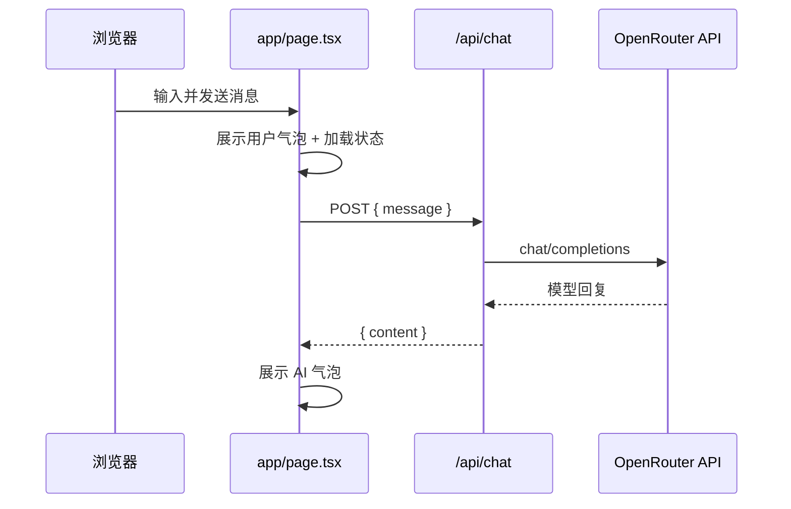

# AI Chat

基于 [Next.js](https://nextjs.org) App Router 构建的轻量级 AI 对话应用，通过 [OpenRouter](https://openrouter.ai) 统一接入多家大语言模型。界面采用深色主题与聊天气泡布局，适合本地开发与二次扩展。

## 功能特性

- **对话界面** — ChatGPT 风格的深色 UI，支持多轮消息展示
- **消息气泡** — 用户与 AI 消息左右分栏，带圆角与小尾巴样式
- **加载状态** — 请求进行中显示「AI正在思考」与跳动指示点
- **快捷键** — `Enter` 发送，`Shift + Enter` 换行
- **服务端代理** — API Key 仅存于服务端环境变量，不暴露给浏览器

## 技术栈

| 类别 | 技术 |
|------|------|
| 框架 | Next.js 16（App Router） |
| UI | React 19、Tailwind CSS 4 |
| 语言 | TypeScript 5 |
| AI 网关 | OpenRouter Chat Completions API |

## 架构概览



## 环境要求

- **Node.js** 18.18 或更高版本（推荐 20 LTS）
- **npm**、pnpm、yarn 或 bun 任一包管理器
- 有效的 [OpenRouter](https://openrouter.ai/keys) API Key

## 快速开始

### 1. 克隆并安装依赖

```bash
git clone <your-repo-url>
cd ai-chat
npm install
```

### 2. 配置环境变量

在项目根目录创建 `.env.local`（已被 `.gitignore` 忽略，请勿提交到版本库）：

```env
# 必填：OpenRouter API Key
OPENROUTER_API_KEY=sk-or-v1-xxxxxxxx

# 可选：默认模型（未设置时使用 deepseek/deepseek-chat）
OPENROUTER_MODEL=deepseek/deepseek-chat

# 可选：OpenRouter 统计用站点信息
OPENROUTER_SITE_URL=http://localhost:3000
OPENROUTER_APP_NAME=AI Chat
```

修改环境变量后需**重启**开发服务器才能生效。

### 3. 启动开发服务器

```bash
npm run dev
```

在浏览器打开 [http://localhost:3000](http://localhost:3000) 即可使用。

### 4. 生产构建

```bash
npm run build
npm run start
```

## 环境变量说明

| 变量名 | 必填 | 默认值 | 说明 |
|--------|:----:|--------|------|
| `OPENROUTER_API_KEY` | 是 | — | OpenRouter 平台 API Key |
| `OPENROUTER_MODEL` | 否 | `deepseek/deepseek-chat` | 模型 ID，见 [OpenRouter 模型列表](https://openrouter.ai/models) |
| `OPENROUTER_SITE_URL` | 否 | `http://localhost:3000` | 请求头 `HTTP-Referer`，用于 OpenRouter 排行统计 |
| `OPENROUTER_APP_NAME` | 否 | `AI Chat` | 请求头 `X-Title`，应用展示名称 |

## 项目结构

```
ai-chat/
├── app/
│   ├── api/
│   │   └── chat/
│   │       └── route.ts      # 服务端：转发 OpenRouter 请求
│   ├── components/
│   │   └── message-bubble.tsx # 消息气泡与加载中组件
│   ├── globals.css           # 全局样式与气泡动画
│   ├── layout.tsx            # 根布局与元数据
│   └── page.tsx              # 聊天主页面（客户端）
├── public/                   # 静态资源
├── .env.local                # 本地环境变量（需自行创建）
├── next.config.ts
├── package.json
└── README.md
```

## 可用脚本

| 命令 | 说明 |
|------|------|
| `npm run dev` | 启动开发服务器（热更新） |
| `npm run build` | 生产环境构建 |
| `npm run start` | 运行生产构建结果 |
| `npm run lint` | 运行 ESLint 检查 |

## API 接口

### `POST /api/chat`

将用户单条消息转发至 OpenRouter，并返回模型回复文本。

**请求体**

```json
{
  "message": "你好，请介绍一下你自己。"
}
```

**成功响应** `200`

```json
{
  "content": "你好！我是……"
}
```

**错误说明**

- 未配置 `OPENROUTER_API_KEY` 时返回 `500`，`content` 字段包含中文提示
- OpenRouter 返回错误时，将错误信息透传至 `content`

> 当前实现为**单轮**对话（每次请求仅携带最新一条用户消息）。如需多轮上下文，需在 `route.ts` 中扩展 `messages` 数组并在前端传递历史记录。

## 部署

### Vercel（推荐）

1. 将仓库导入 [Vercel](https://vercel.com)
2. 在 Project Settings → Environment Variables 中配置上述环境变量
3. 部署完成后访问分配的域名

### 其他平台

任何支持 Node.js 与 Next.js 的托管服务均可使用，构建命令为 `npm run build`，启动命令为 `npm run start`，并确保运行时能读取环境变量。

## 安全提示

- **切勿**将 `.env.local` 或 API Key 提交到 Git 仓库
- API Key 仅通过 `app/api/chat/route.ts` 在服务端使用，前端不直接调用 OpenRouter
- 若 Key 曾泄露，请立即在 OpenRouter 控制台轮换密钥

## 常见问题

**页面提示未配置 API Key**

确认 `.env.local` 位于项目根目录、变量名为 `OPENROUTER_API_KEY`、文件编码为 UTF-8，并已重启 `npm run dev`。

**模型无响应或报错**

检查 OpenRouter 账户余额、所选 `OPENROUTER_MODEL` 是否可用，以及网络是否能访问 `openrouter.ai`。

**构建时出现 workspace root 警告**

若本机存在多个 `package-lock.json`，可在 `next.config.ts` 中配置 `turbopack.root` 指向本项目目录，或移除无关的 lockfile。

## 后续可扩展方向

- [ ] 多轮对话上下文
- [ ] 流式输出（SSE）
- [ ] 会话历史持久化
- [ ] 模型切换 UI
- [ ] Markdown / 代码高亮渲染

## 许可证

本项目为私有仓库（`package.json` 中 `"private": true`）。对外分发前请自行补充许可证条款。
