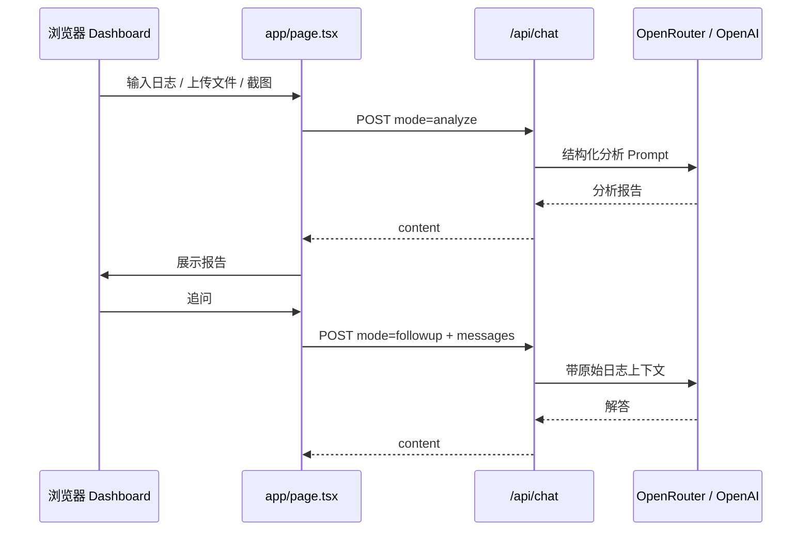

# AI Analyzer

面向运维与 SRE 的 **AI 智能日志分析平台**。基于 Next.js 构建，支持文本日志、`.log` 文件与截图的多模态分析，输出结构化故障报告，并支持分析后继续多轮追问。


## 预览

- **Dashboard 运维台风格**：统计卡片、双栏面板、实时状态指示
- **深色主题**：适合机房 / 值班场景长时间使用

## 功能特性

### 日志分析

- 粘贴或上传 `.log` / 纯文本日志
- 自动识别 **MySQL、Kubernetes、Kafka、Nginx、Redis、Docker** 等常见运维日志
- 结构化输出：**错误原因 · 业务影响 · 修复建议 · 风险等级**

### 多模态输入

- 上传或粘贴**截图**（报错弹窗、终端、监控面板等）
- `Ctrl+V` 智能识别：纯文本 / 图片 / `.log` 文件
- 日志与图片可**组合分析**

### 分析后对话

- 首屏生成完整分析报告
- 对结论有疑问可**继续追问**，AI 结合原始日志与上下文解答

### AI 与网络

- **OpenRouter**（推荐，DeepSeek 等，成本低）
- **OpenAI 官方 API**（可选，需单独充值）
- 支持 `HTTPS_PROXY`，适配国内代理环境

## 技术栈

| 类别 | 技术 |
|------|------|
| 框架 | Next.js 16（App Router） |
| UI | React 19、Tailwind CSS 4 |
| 语言 | TypeScript 5 |
| AI | OpenRouter / OpenAI Chat Completions |
| 代理 | undici ProxyAgent |

## 架构



## 快速开始

### 环境要求

- Node.js 18.18+（推荐 20 LTS）
- [OpenRouter](https://openrouter.ai/keys) API Key（推荐）或 OpenAI API Key

### 安装

```bash
git clone https://github.com/alongAox/ai-analyzer.git
cd ai-analyzer
npm install
```

### 配置

```bash
copy .env.example .env.local   # Windows
# cp .env.example .env.local   # macOS / Linux
```

**推荐配置（OpenRouter）**

```env
OPENROUTER_API_KEY=sk-or-v1-xxxxxxxx
OPENROUTER_MODEL=deepseek/deepseek-chat
OPENROUTER_VISION_MODEL=openai/gpt-4o-mini

# 国内建议配置代理（端口按 Clash 等软件为准）
HTTPS_PROXY=http://127.0.0.1:7890
```

修改 `.env.local` 后需**重启**开发服务器。

### 运行

```bash
npm run dev
```

访问 [http://localhost:3000](http://localhost:3000)。

### 生产构建

```bash
npm run build
npm run start
```

## 环境变量

| 变量名 | 必填 | 默认值 | 说明 |
|--------|:----:|--------|------|
| `OPENROUTER_API_KEY` | 二选一 | — | OpenRouter Key（推荐） |
| `OPENROUTER_MODEL` | 否 | `deepseek/deepseek-chat` | 文本分析模型 |
| `OPENROUTER_VISION_MODEL` | 否 | `openai/gpt-4o-mini` | 图片分析模型 |
| `OPENAI_API_KEY` | 二选一 | — | OpenAI Key（配置后优先） |
| `OPENAI_MODEL` | 否 | `gpt-4o-mini` | OpenAI 文本模型 |
| `OPENAI_VISION_MODEL` | 否 | `gpt-4o-mini` | OpenAI 视觉模型 |
| `HTTPS_PROXY` | 否 | — | HTTP(S) 代理地址 |
| `OPENROUTER_SITE_URL` | 否 | `http://localhost:3000` | OpenRouter Referer |
| `OPENROUTER_APP_NAME` | 否 | `AI Analyzer` | OpenRouter 应用名 |

## 项目结构

```
ai-analyzer/
├── app/
│   ├── api/chat/
│   │   ├── route.ts       # 分析 & 追问 API
│   │   └── prompts.ts     # 运维分析 Prompt
│   ├── components/
│   │   └── dashboard-icons.tsx
│   ├── globals.css        # Dashboard 主题
│   ├── layout.tsx
│   └── page.tsx           # Dashboard 主界面
├── .env.example
├── package.json
└── README.md
```

## API

### `POST /api/chat`

**初次分析** `mode: "analyze"`（可省略，默认）

```json
{
  "logs": "2024-01-01 ERROR ...",
  "images": [{ "name": "err.png", "dataUrl": "data:image/png;base64,..." }]
}
```

**追问** `mode: "followup"`

```json
{
  "logs": "原始日志（提供上下文）",
  "messages": [
    { "role": "assistant", "content": "分析报告..." },
    { "role": "user", "content": "风险等级为高是什么意思？" }
  ]
}
```

**响应**

```json
{ "content": "..." }
```

## 使用指南

| 操作 | 说明 |
|------|------|
| 输入日志 | 粘贴到左侧终端风格输入框 |
| 上传 `.log` | 点击「.log 文件」 |
| 上传图片 | 点击「图片」 |
| 粘贴截图/文件 | 输入框内 `Ctrl+V` |
| 开始分析 | 顶栏「开始分析」 |
| 追问 | 分析完成后在右侧输入框继续提问 |

## 常见问题

**未配置 API Key**

检查 `.env.local` 中 `OPENROUTER_API_KEY` 或 `OPENAI_API_KEY`，重启 `npm run dev`。

**网络超时 / Connection reset**

配置 `HTTPS_PROXY` 并开启 VPN，重启服务。浏览器能访问不等于 Node 能访问。

**OpenAI quota exceeded**

OpenAI API 需单独绑卡充值，ChatGPT Plus 不含 API 额度。建议改用 OpenRouter + DeepSeek。

**图片分析失败**

确认 `OPENROUTER_VISION_MODEL` 为支持视觉的模型（如 `openai/gpt-4o-mini`）。

## 安全

- **切勿**提交 `.env.local` 或 API Key 到 Git
- Key 仅用于服务端 `app/api/chat/route.ts`
- 泄露后立即在平台轮换密钥

## 脚本

| 命令 | 说明 |
|------|------|
| `npm run dev` | 开发模式 |
| `npm run build` | 生产构建 |
| `npm run start` | 启动生产服务 |
| `npm run lint` | ESLint |

## 许可证

私有项目（`package.json` 中 `"private": true`）。
