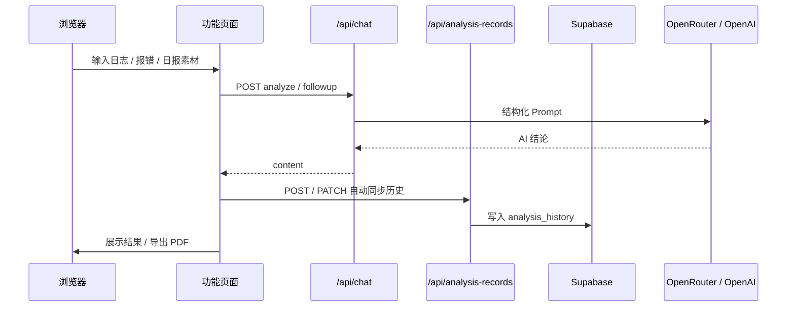

# AI Analyzer · Ops Intelligence

面向运维与 SRE 的 **AI 智能分析平台**。基于 Next.js 16 构建，集成日志分析、错误解释、运维日报、数据统计与 PDF 报告导出；支持 Supabase 登录与分析历史持久化。


## 预览

- **SaaS 风格项目首页**：`/`` 展示项目介绍、功能特性、技术栈
- **Dashboard 运维台**：统计卡片、饼图分布、分析记录概览
- **深色主题**：终端风格输入，适合机房 / 值班长时间使用

## 功能模块

| 模块 | 路径 | 说明 |
|------|------|------|
| 项目首页 | `/` | Landing Page，产品介绍与功能导航 |
| Dashboard | `/dashboard` | 分析统计、类型分布、导出统计报告 PDF |
| 日志分析 | `/log-analyzer` | 多模态日志分析，支持追问与 PDF 导出 |
| 错误解释 | `/error-explainer` | 报错堆栈 AI 解读，支持多轮对话 |
| 运维日报 | `/daily-report` | 日志生成结构化日报，暂存与 PDF 导出 |
| 分析历史 | `/history` | Supabase 持久化，含完整追问过程 |
| 登录 | `/login` | Supabase Email 认证 |

### 日志分析

- 粘贴或上传 `.log` / 纯文本日志
- 自动识别 **MySQL、Kubernetes、Kafka、Nginx、Redis、Docker** 等常见运维日志
- 上传或粘贴**截图**（报错弹窗、终端、监控面板等），`Ctrl+V` 智能识别
- 结构化输出：**错误原因 · 业务影响 · 修复建议 · 风险等级**
- 分析完成后可**继续追问**

### 错误解释 & 运维日报

- **错误解释器**：输入异常信息，AI 从运维视角解读根因与排查路径
- **日报生成器**：基于值班日志一键生成结构化运维日报

### 数据与导出

- **分析历史**：分析完成后**自动保存**至 Supabase（含追问），无需手动点保存
- **会话缓存**：切换侧边栏导航后，已完成分析自动暂存至 localStorage，返回可恢复
- **PDF 导出**：各功能页与 Dashboard 支持导出 PDF（含分析时间、用户输入、AI 结论）

### AI 与网络

- **OpenRouter**（推荐，DeepSeek 等，成本低）
- **OpenAI 官方 API**（可选，配置后优先）
- 支持 `HTTPS_PROXY`，适配国内代理环境

## 技术栈

| 类别 | 技术 |
|------|------|
| 框架 | Next.js 16（App Router · Server Components） |
| UI | React 19、Tailwind CSS 4 |
| 语言 | TypeScript 5 |
| 认证与数据 | Supabase Auth、PostgreSQL、RLS |
| AI | OpenRouter / OpenAI Chat Completions、多模态视觉 |
| 导出 | jsPDF、html2canvas |
| 代理 | undici ProxyAgent |

## 架构



## 快速开始

### 环境要求

- Node.js 18.18+（推荐 20 LTS）
- [OpenRouter](https://openrouter.ai/keys) API Key（推荐）或 OpenAI API Key
- [Supabase](https://supabase.com) 项目（登录 + 分析历史，可选但推荐）

### 安装

```bash
git clone https://github.com/alongAox/ai-ops-toolkit.git
cd ai-ops-toolkit
npm install
```

### 配置

```bash
copy .env.example .env.local   # Windows
# cp .env.example .env.local   # macOS / Linux
```

**AI（OpenRouter 推荐）**

```env
OPENROUTER_API_KEY=sk-or-v1-xxxxxxxx
OPENROUTER_MODEL=deepseek/deepseek-chat
OPENROUTER_VISION_MODEL=openai/gpt-4o-mini

# 国内建议配置代理
HTTPS_PROXY=http://127.0.0.1:7890
```

**Supabase（登录 + 历史记录）**

```env
NEXT_PUBLIC_SUPABASE_URL=https://xxxxxxxx.supabase.co
NEXT_PUBLIC_SUPABASE_PUBLISHABLE_KEY=sb_publishable_xxxxxxxx
SUPABASE_SECRET_KEY=sb_secret_xxxxxxxx
```

在 Supabase **SQL Editor** 中依次执行：

1. `supabase/migrations/001_analysis_history.sql`（必需）
2. `supabase/migrations/002_analysis_history_user_id.sql`（若 001 已含 user_id 可跳过）
3. `supabase/migrations/003_analysis_stats_rpc.sql`（Dashboard 统计，推荐）

并在 Supabase **Authentication** 中启用 Email 登录、创建用户。

未配置 Supabase 时，仍可使用 AI 分析功能；登录与历史记录不可用。

修改 `.env.local` 后需**重启**开发服务器。

### 运行

```bash
npm run dev
```

- 项目首页：[http://localhost:3000](http://localhost:3000)
- 控制台（需登录）：[http://localhost:3000/dashboard](http://localhost:3000/dashboard)

### 生产构建

```bash
npm run build
npm run start
```

## 环境变量

| 变量名 | 必填 | 默认值 | 说明 |
|--------|:----:|--------|------|
| `OPENROUTER_API_KEY` | 二选一 | — | OpenRouter Key（推荐） |
| `OPENROUTER_MODEL` | 否 | `deepseek/deepseek-chat` | 文本分析模型 |
| `OPENROUTER_VISION_MODEL` | 否 | `openai/gpt-4o-mini` | 图片分析模型 |
| `OPENAI_API_KEY` | 二选一 | — | OpenAI Key（配置后优先） |
| `OPENAI_MODEL` | 否 | `gpt-4o-mini` | OpenAI 文本模型 |
| `OPENAI_VISION_MODEL` | 否 | `gpt-4o-mini` | OpenAI 视觉模型 |
| `HTTPS_PROXY` | 否 | — | HTTP(S) 代理地址 |
| `OPENROUTER_SITE_URL` | 否 | `http://localhost:3000` | OpenRouter Referer |
| `OPENROUTER_APP_NAME` | 否 | `AI Analyzer` | OpenRouter 应用名 |
| `NEXT_PUBLIC_SUPABASE_URL` | 历史/登录 | — | Supabase 项目 URL |
| `NEXT_PUBLIC_SUPABASE_PUBLISHABLE_KEY` | 历史/登录 | — | 客户端 Publishable Key |
| `SUPABASE_SECRET_KEY` | 历史/登录 | — | 服务端 Secret Key（API 写入） |

## 项目结构

```
ai-ops-toolkit/
├── app/
│   ├── page.tsx                    # 项目首页（Landing Page）
│   ├── layout.tsx
│   ├── globals.css
│   ├── components/
│   │   ├── landing-page.tsx        # SaaS 首页
│   │   ├── app-sidebar.tsx         # 应用侧边栏
│   │   ├── export-pdf-button.tsx   # PDF 导出按钮
│   │   ├── daily-report-generator.tsx
│   │   └── ...
│   ├── (master)/
│   │   ├── login/page.tsx
│   │   └── (app)/                  # 需登录的应用页
│   │       ├── dashboard/
│   │       ├── log-analyzer/
│   │       ├── error-explainer/
│   │       ├── daily-report/
│   │       └── history/
│   ├── api/
│   │   ├── chat/                   # AI 分析 & 追问
│   │   ├── analysis-records/       # 历史 CRUD + 统计
│   │   └── auth/                   # 登录 / 登出
│   └── auth/callback/              # Supabase OAuth 回调
├── lib/
│   ├── analysis-records.ts         # 历史记录客户端
│   ├── export-analysis-pdf.ts      # 分析 PDF 导出
│   ├── export-dashboard-stats-pdf.ts
│   ├── feature-session-cache.ts    # 导航会话缓存
│   └── supabase/                   # Supabase 客户端与鉴权
├── supabase/migrations/            # 数据库迁移 SQL
├── proxy.ts                        # Next.js 16 路由代理（鉴权）
├── .env.example
└── package.json
```

## API

### `POST /api/chat`

**初次分析**（`mode: "analyze"`，可省略）

```json
{
  "logs": "2024-01-01 ERROR ...",
  "images": [{ "name": "err.png", "dataUrl": "data:image/png;base64,..." }]
}
```

**追问**（`mode: "followup"`）

```json
{
  "logs": "原始日志（提供上下文）",
  "messages": [
    { "role": "assistant", "content": "分析报告..." },
    { "role": "user", "content": "风险等级为高是什么意思？" }
  ]
}
```

**响应**：`{ "content": "..." }`

### `GET / POST / PATCH /api/analysis-records`

- `GET` — 列表与详情（需登录）
- `POST` — 创建记录（分析完成时自动调用）
- `PATCH` — 更新记录（追问后自动同步）

### `GET /api/analysis-records/stats`

Dashboard 统计数据（需登录 + 执行 `003_analysis_stats_rpc.sql`）。

## 使用指南

| 操作 | 说明 |
|------|------|
| 访问首页 | 打开 `/` 或侧边栏「首页」 |
| 输入日志 | 粘贴到终端风格输入框 |
| 上传 `.log` / 图片 | 对应按钮或 `Ctrl+V` |
| 开始分析 | 点击「开始分析」/「生成日报」等 |
| 追问 | 分析完成后在对话框继续提问 |
| 导出 PDF | 分析完成后点击「导出 PDF」 |
| 查看历史 | 侧边栏 History，含完整追问过程 |
| 会话恢复 | 切换导航后返回，从缓存区恢复 |

## 常见问题

**未配置 API Key**

检查 `.env.local` 中 `OPENROUTER_API_KEY` 或 `OPENAI_API_KEY`，重启 `npm run dev`。

**登录后看不到历史 / Dashboard 无数据**

确认 Supabase 三个环境变量已配置，且已在 SQL Editor 执行迁移脚本；需用已创建的 Supabase 用户登录。

**网络超时 / Connection reset**

配置 `HTTPS_PROXY` 并开启代理，重启服务。浏览器能访问不等于 Node 能访问。

**OpenAI quota exceeded**

OpenAI API 需单独绑卡充值。建议改用 OpenRouter + DeepSeek。

**图片分析失败**

确认 `OPENROUTER_VISION_MODEL` 为支持视觉的模型（如 `openai/gpt-4o-mini`）。

## 安全

- **切勿**提交 `.env.local` 或 API Key / Supabase Secret 到 Git
- AI Key 仅用于服务端 `app/api/chat/route.ts`
- `SUPABASE_SECRET_KEY` 仅用于服务端 API，不可暴露到客户端
- 泄露后立即在对应平台轮换密钥

## 脚本

| 命令 | 说明 |
|------|------|
| `npm run dev` | 开发模式 |
| `npm run build` | 生产构建 |
| `npm run start` | 启动生产服务 |
| `npm run lint` | ESLint |

## 许可证

私有项目（`package.json` 中 `"private": true`）。
